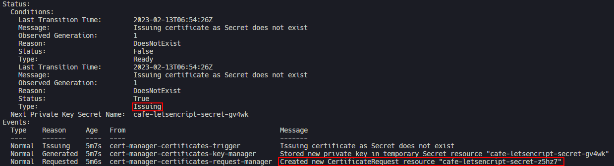
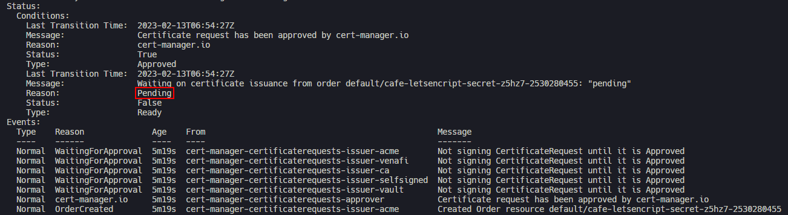

# Cert Manager
Is a Cloud native certificate management
Objective:
- **Understand** how to deploy Cer manager.
- **Deploy** cert manager to generate letsencript SSL using DNS challange.

## Istallation guide
On thi repo the cert manager deploy using **kubectl apply** you can using this [link](https://cert-manager.io/docs/installation/kubectl/)

**Spec:**
cer-manager : v1.11.0

## Generate the lets encript SSL
Deploy the API key as a secret
```bash
kubectl apply -f secret-cflr.yaml
```
Deploy cluster issuer
```bash
kubectl apply -f cluster-issuer-acme.yaml
```
Request the certificate
```bash
kubectl apply -f prod-certificate.yaml
```
## Tshoot
Check the certificate status
```bash
kubectl describe certificate
```
output:


Check the certificate request status, if pending it's need more time
```bash
kubectl describe certificaterequest
```
output:

<a rel="license" href="http://creativecommons.org/licenses/by-nc/4.0/"></a><br />This work is licensed under a <a rel="license" href="http://creativecommons.org/licenses/by-nc/4.0/">Creative Commons Attribution-NonCommercial 4.0 International License</a>.